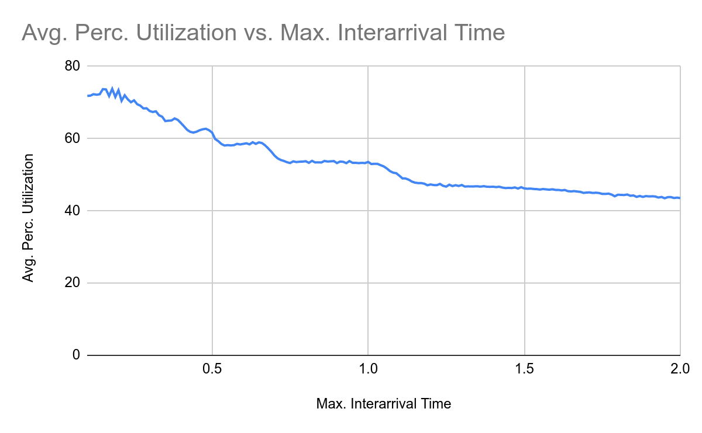

# Introduction

This project was made for the evaluation of the innovative work for the subject of Modelling and Simulation.

It aims to simulate the medical system in a small remote area to determine the number of beds and ambulances required to provide timely access to health care so that deaths due to such delays can be minimzed.

It also tries gather data around various statistical counters and analyze their relationships with the input parameters describing the remote area.

# Model

The model is a Discrete Event Simulation (DES) model implemented via two consecutive queueing channels following the priority queue discipline:

-   Patients (customers) and ambulances (servers)
-   Patients (customers) and beds (servers)

    

        
    

    

        <i>Fig.</i>
        Flow of patients through the system
    

For further reading about the model and it's implementation, please refer to the `Report.pdf` attached alongside the code. Downloading the file recommended for best viewing experience.

# Simulation

The program produces statistical results like average dealy, average queue length and percentage utilization of the system. Below is some sample input data to demonstrate the simualtion.

## Input

<table>
    <tr>
        <th>Parameter</th>
        <th>Value</th>
    </tr>
    <tr>
        <td>The maximum inter-arrival time between the patients</td>
        <td>0.5 hours</td>
    </tr>
    <tr>
        <td>Maximum severity up to which injury/sickness is non-fatal (in terms of recovery time)</td>
        <td>30 km</td>
    </tr>
    <tr>
        <td>Maximum deaths due to delay before an ambulance is added to services</td>
        <td>10 hours</td>
    </tr>
    <tr>
        <td>Ambulance’s average speed as per infrastructural/topological conditions</td>
        <td>30 km/hr</td>
    </tr>
    <tr>
        <td>Rate parameter of the exponential probability distribution determining the initial severity</td>
        <td>4</td>
    </tr>
</table>

## Output

<table>
    <tr>
        <th>Parameter</th>
        <th>Ambulances</th>
        <th>Beds</th>
    </tr>
    <tr>
        <td>Quantity</td>
        <td>4.3680</td>
        <td>23.5680</td>
    </tr>
    <tr>
        <td>Average Delay</td>
        <td>1.3433</td>
        <td>0.1198</td>
    </tr>
    <tr>
        <td>Average Queue Length</td>
        <td>5.3568</td>
        <td>0.4890</td>
    </tr>
    <tr>
        <td>Percentage Utilization</td>
        <td>90.7816</td>
        <td>62.0645</td>
    </tr>
</table>

# Analysis

The simlations were run again and again and graphs were plotted to understand the behaviour and relation among the statistical results obtained and various input parameters.

## Graphs

    
    
    
    
    
    
    
    

## Trends observed

-   Both channels show similar trends for similar parameters.

-   As expected, the number of ambulances, number of beds, average delay, average percentage utilization and average queue length have a decreasing trend overall.

-   However, spikes and dips are observed. This is expected due to the maximum cap put on the number of deaths before simulation restarts.

-   As maximum inter-arrival time changes, deaths ∈ [0, maxDeaths) oscillates as maxDeaths-1, maxDeaths-2, …, 1, 0, maxDeaths-1, maxDeaths-2, ....due to the simulation design aimed at predicting the absolute minimum possible value of ambulances/beds required.

-   This discontinuity is responsible for the spikes and dips. As we reach the most loose state (deaths = 0), resources required are dropped leading to a sudden increase in the pressure on the system (deaths = maxDeaths-1)
